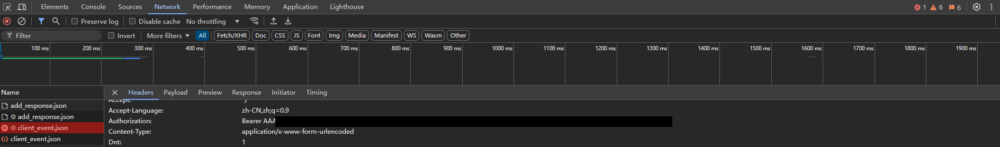
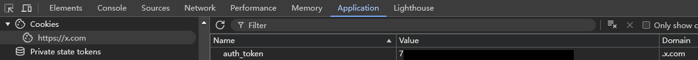

# openai-to-grok-proxy

A janky proxy server that converts OpenAI API format requests to Grok API format.

## Authentication Setup

1. Navigate to grok.x.com
2. Open DevTools (Press F12)
3. Send something
4. In Network tab, locate 'client_event.json' request
5. Copy the 'authorization' value from request headers as auth_bearer

6. Get auth_token from Application -> Cookies -> https://x.com

## API Key Format

The final API key format should be:
$auth_bearer,$auth_token